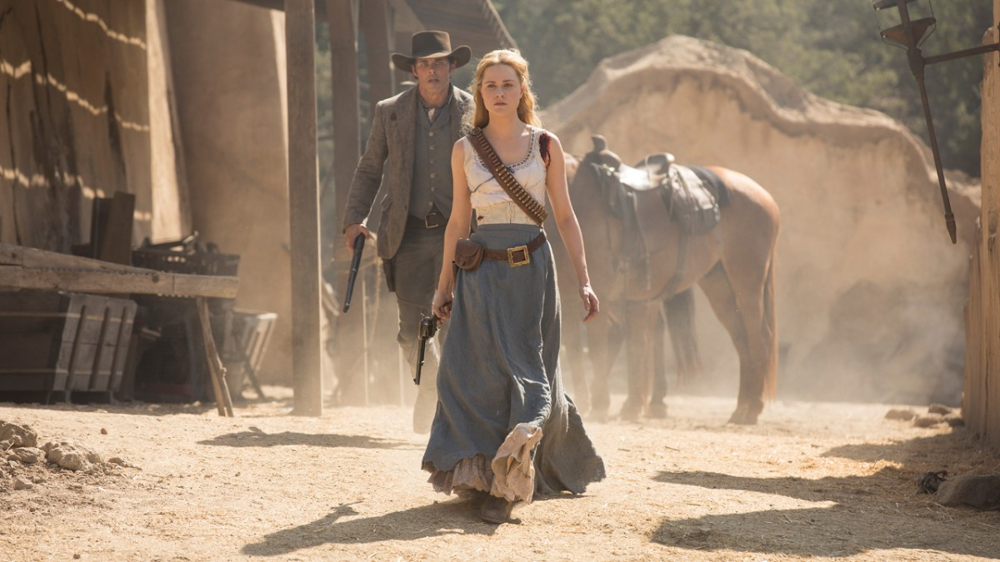
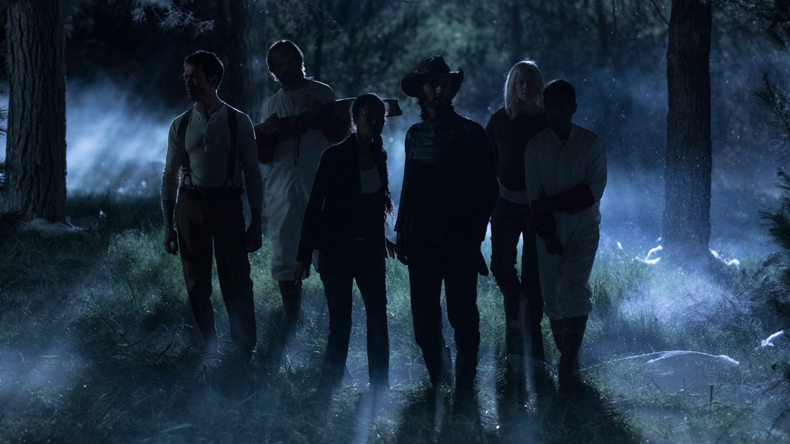

## Welcome To The Raj

### The Raj is Park 6.

Set in a world modeled after British Colonial India, The Raj introduces us to a new cast of characters; including a mysterious guest, plenty of glitching hosts and a bloodthirsty Bengal tiger. (Could it be the same tiger that washed up on Westworld’s shores at the end of Episode 1?). A nameless woman discloses to her confidante Nicholas that she’s hunting something greater in this game, though what she’s after remains to be seen. Shortly after discovering the hosts are deeply off loop, however, she becomes the hunted in a chase to the boundary of The Raj. The tiger closes in on her, she fires her gun and falls off a bluff as the screen cuts to black.

<!-- there's a way easier way to add the embedded images it turns out -->

<Box sx={{figure: {width: ['100%', 200], float: 'left', mr: 3}}}>

</Box>

### Dolores — and Teddy — reveal their true selves at Fort Forlorn Hope.

Before she shows us just how ruthless Wyatt can be, Dolores is briefly reunited with Bernard and her father, a badly malfunctioning Peter Abernathy, who’s later taken prisoner by Charlotte Hale amidst the battle at Fort Forlorn Hope. When the fight is over and an emotionally numb Dolores tells Teddy to execute Major Craddock, she witnesses a side of him she hasn’t seen before: betrayal. Teddy can’t bring himself to pull the trigger and lets Craddock go, triggering something dark in Dolores.

### Maeve stumbles into dangerous territory.

When her ragtag team — Lee, Hector, Felix, Lutz and now, a flamethrowing Armistice — are safe from the dangerous depths of Westworld, Maeve continues the search for her daughter above ground. It isn’t clear just how far this unlikely band of allies has ventured until the landscape shifts and snowfall enters what we thought was a desert. After stumbling upon a severed, armored head, it dawns on Lee as to where they’ve wandered, but it’s too late: a samurai charges at them in the dark.
